# 🏕️ Campexxa

Campexxa is a full-stack web application for discovering, creating, and reviewing outdoor and leisure spots such as campgrounds, hiking spots, and food destinations. It is built with a scalable architecture and focuses on usability, personalization, and performance.

---

## 🗺️ Overview

Campexxa enables users to explore and share "spots" for travel and leisure. Users can create listings, upload images, leave reviews, and manage their activity through a personalized dashboard.

The platform is designed with modular backend architecture, reusable frontend components, and optimized data handling techniques such as pagination and infinite scrolling.

---

## 🛠️ Tech Stack

### Backend

 
### Database

 
### Frontend

 
### Authentication

 
### Cloud & Storage

 
### Maps & Geolocation

 
### Tools & Libraries

 

---

## ✨ Features

- Full CRUD functionality for spots
- Dynamic search with fuzzy matching
- Advanced filtering and sorting system on price, location, distance, and ratings
- Interactive maps using Mapbox
- Review and rating system
- User dashboard with tabs (spots, saved, reviews, profile)
- **Authentication:**
  - Local (username/password)
  - OAuth (Google, GitHub, Facebook)
- Image upload and management via Cloudinary and Multer
- Pagination and infinite scroll system
- Reusable EJS components for scalability
- Geolocation-based features
- Single-currency pricing system

---

## ⚙️ Engineering Highlights

### 5.1 🔧 Key Engineering Decisions

- Implemented reusable pagination + infinite scroll system using partial rendering and AJAX
- Designed modular API response handler (`sendPaginatedResponse`) for consistent frontend updates
- Abstracted OAuth logic into reusable middleware to avoid duplication across providers
- Used `lean()` + virtuals for performance optimization in MongoDB queries
- Reduced DOM re-renders using partial updates
- Implemented debounced search for better UX
- Structured dashboard with tab-based rendering to reduce route complexity

### 5.2 🔐 Security Practices

- Input validation using Joi
- Protection against NoSQL injection (`mongoSanitize`)
- Authentication with Passport.js
- Rate limiting for sensitive routes (login, forgot password)
- Session-based authentication with secure cookies

### 5.3 📈 Scalability Considerations

- Modular MVC architecture
- Reusable utility functions
- Separation of concerns (routes, controllers, utils)
- Designed to easily plug in frontend frameworks (React-ready backend)

---

## 🏗️ Architecture Highlights

- Modular MVC structure (controllers, routes, models)
- Reusable utility functions and EJS:
  - Pagination handling
  - Partial rendering for infinite scroll
  - API abstraction
- Clean separation of concerns
- Optimized rendering with partials and AJAX
- OAuth flow handled with reusable middleware

---

## 📸 Screenshots

<table>
  <tr>
    <td>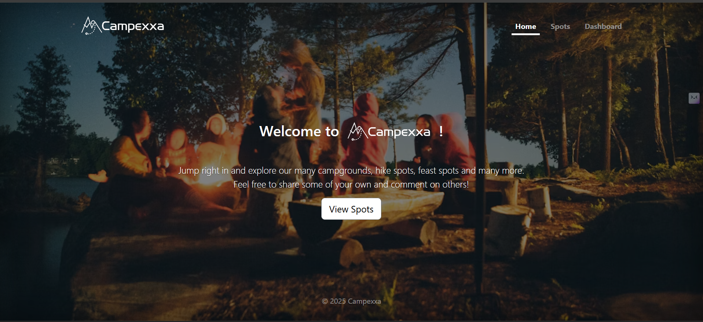</td>
    <td>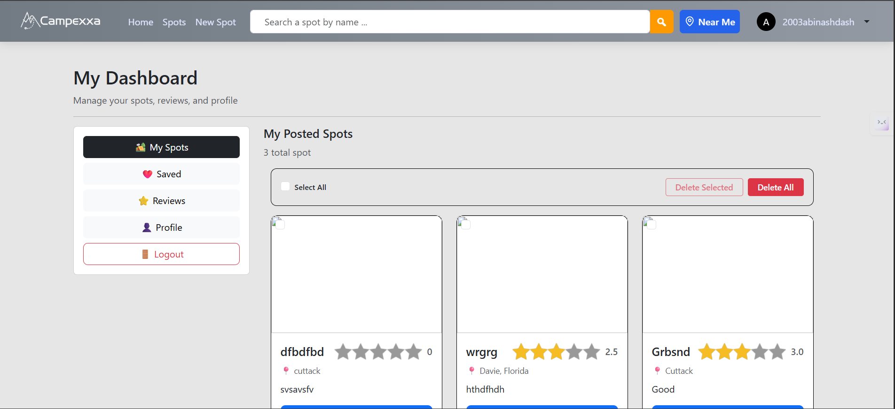</td>
    <td>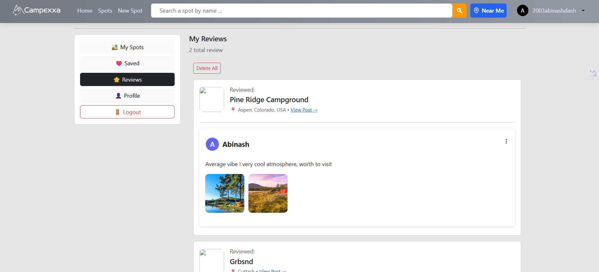</td>
  </tr>
  <tr>
    <td align="center"><b>Homepage</b></td>
    <td align="center"><b>Dashboard 01</b></td>
    <td align="center"><b>Dashboard 02</b></td>
  </tr>
  <tr>
    <td>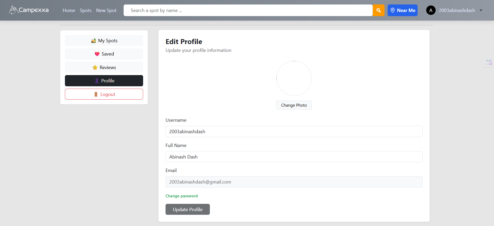</td>
    <td>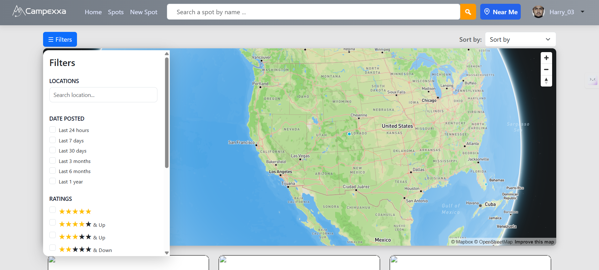</td>
    <td>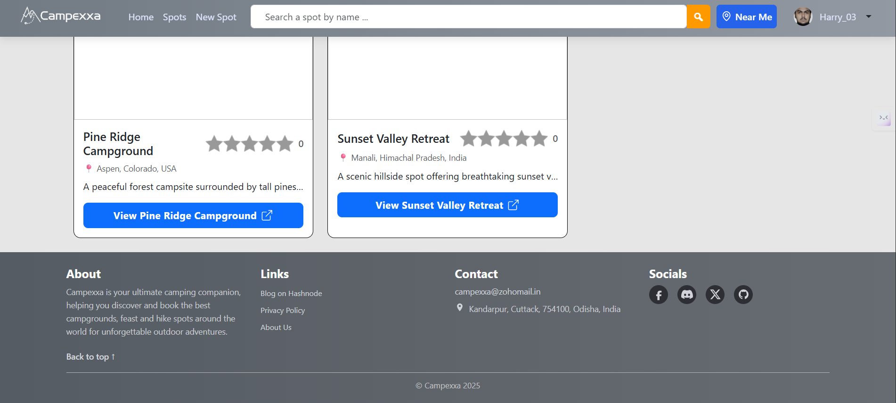</td>
  </tr>
  <tr>
    <td align="center"><b>Dashboard 03</b></td>
    <td align="center"><b>Filter</b></td>
    <td align="center"><b>Footer</b></td>
  </tr>
  <tr>
    <td>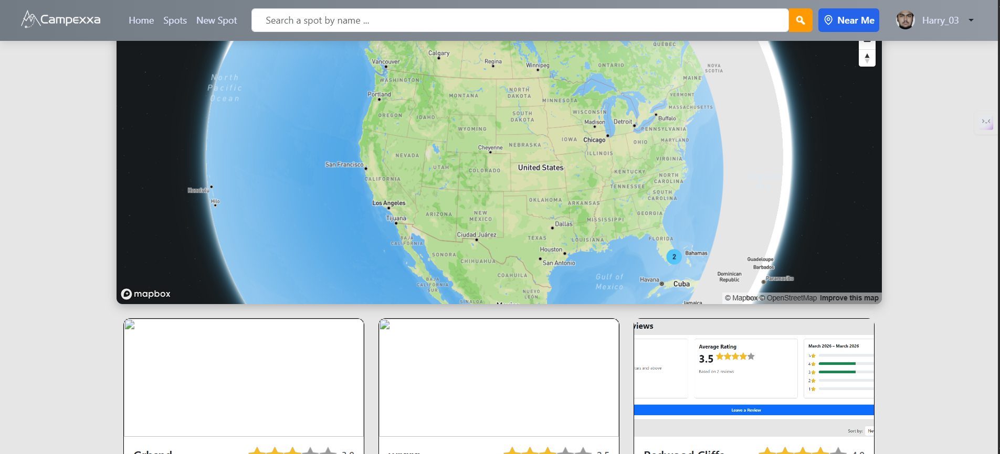</td>
    <td>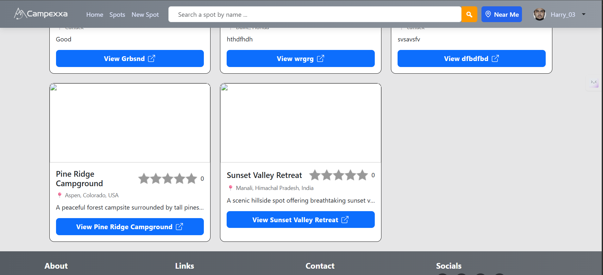</td>
    <td>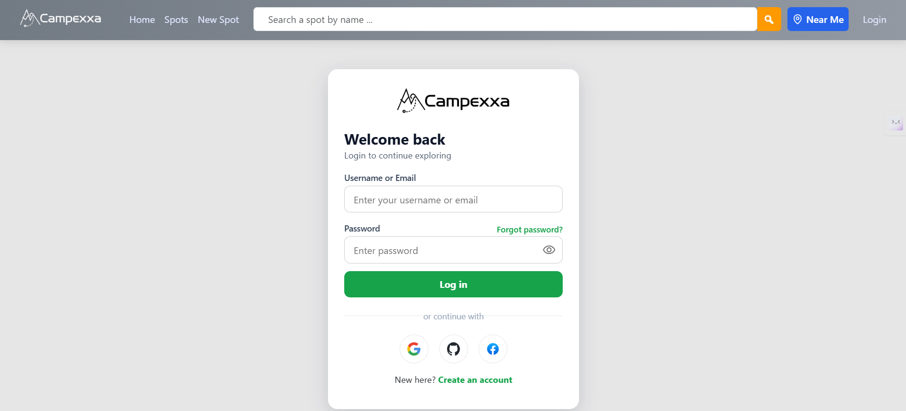</td>
  </tr>
  <tr>
    <td align="center"><b>Listing 01</b></td>
    <td align="center"><b>Listing 02</b></td>
    <td align="center"><b>Login</b></td>
  </tr>
  <tr>
    <td>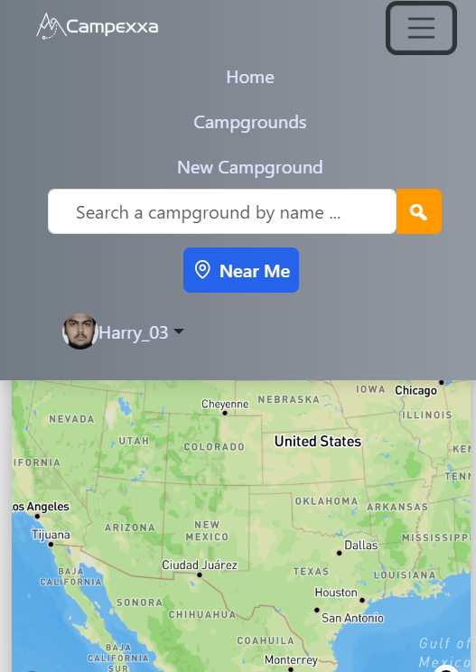</td>
    <td>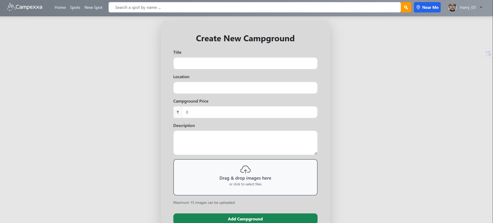</td>
    <td>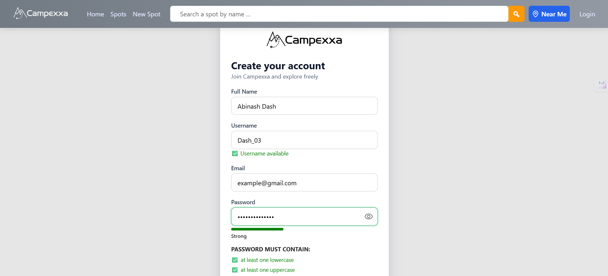</td>
  </tr>
  <tr>
    <td align="center"><b>Mobile Navbar</b></td>
    <td align="center"><b>New Form</b></td>
    <td align="center"><b>Register 01</b></td>
  </tr>
  <tr>
    <td>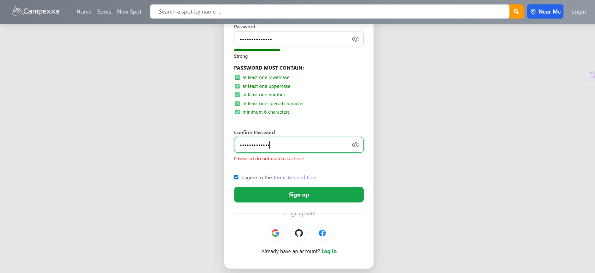</td>
    <td>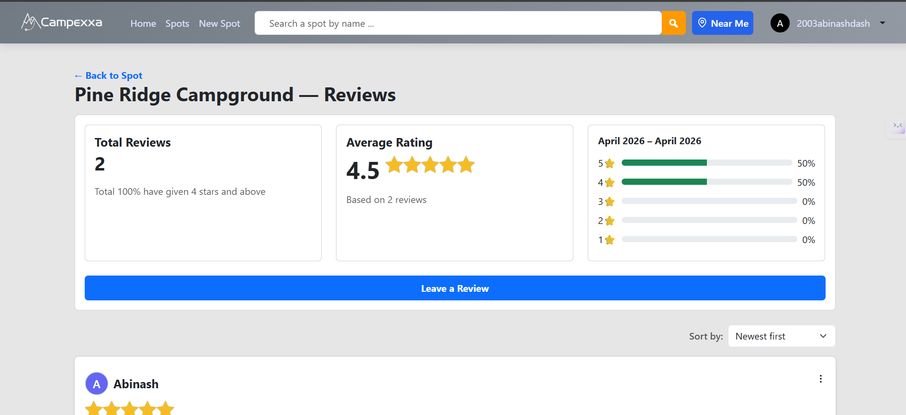</td>
    <td>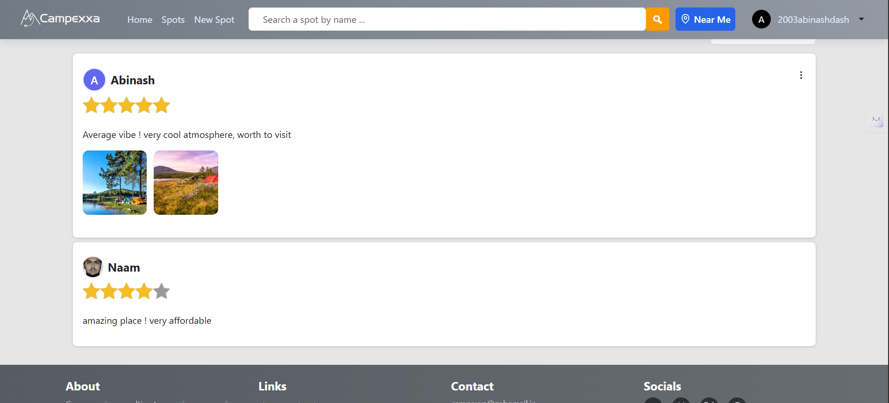</td>
  </tr>
  <tr>
    <td align="center"><b>Register 02</b></td>
    <td align="center"><b>Review Page 01</b></td>
    <td align="center"><b>Review Page 02</b></td>
  </tr>
  <tr>
    <td>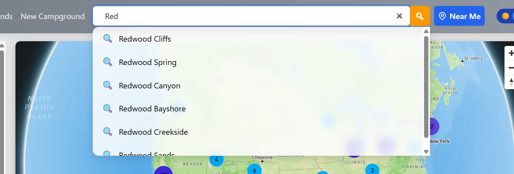</td>
    <td>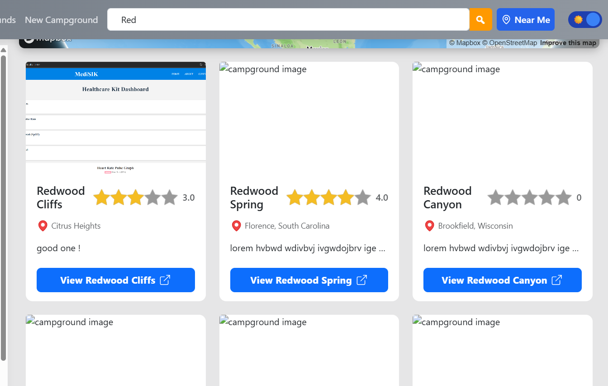</td>
    <td>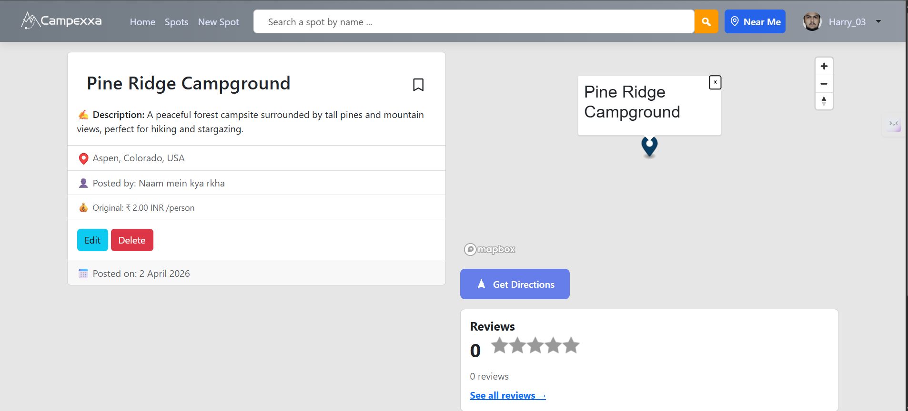</td>
  </tr>
  <tr>
    <td align="center"><b>Searching 01</b></td>
    <td align="center"><b>Searching 02</b></td>
    <td align="center"><b>Show Page</b></td>
  </tr>
</table>

---

## 🚀 Live Link

[View Live App](https://campexxa.onrender.com)

---

## 🔮 Future Improvements

- Improved UI using Tailwind CSS
- Migration to a modern frontend framework (e.g., React)
- Caching layer for faster response times
- Real-time chat between users
- Multi-currency pricing system
- Real-time email notifications for login and other web app activities

---

## 💡 Technical Learnings and blogs

This project includes practical solutions to real-world issues such as:

- Preserving `returnTo` across OAuth flows using `res.locals`
- Handling session persistence during redirects
- Implementing reusable infinite scroll architecture
- Managing dynamic UI updates without frontend frameworks. 
- Mongo virtuals disappear after using lean() in backend.

Here are a few blogs which i published on hashnode, during development of this project. 
- [Blog 1 – OAuth returnTo fix](https://redirect-after-login-bug-in-express.hashnode.dev/fixing-the-redirect-after-login-bug-in-expressjs-passportjs)
- [Blog 2 – Pagination Vs Infinite scroll architecture](https://pagination-vs-infinite-scroll.hashnode.dev/pagination-vs-infinite-scroll-which-ui-should-you-implement)
- [Blog 3 – Dynamic Searching](https://dynamicsearch.hashnode.dev/normal-search-vs-dynamic-search-how-modern-apps-actually-do-it)
- [Blog 4 – Mongoose virtual disappear after .lean()](https://mongo-virtuals-disappear-bug.hashnode.dev/when-mongoose-virtuals-disappear-understanding-the-lean-tradeoff)

---

## 👤 Author

**Abinash Dash**

- GitHub: [AbiDev2003](https://github.com/AbiDev2003)
- LinkedIn: [abinashdev](https://www.linkedin.com/in/abinashdev/)